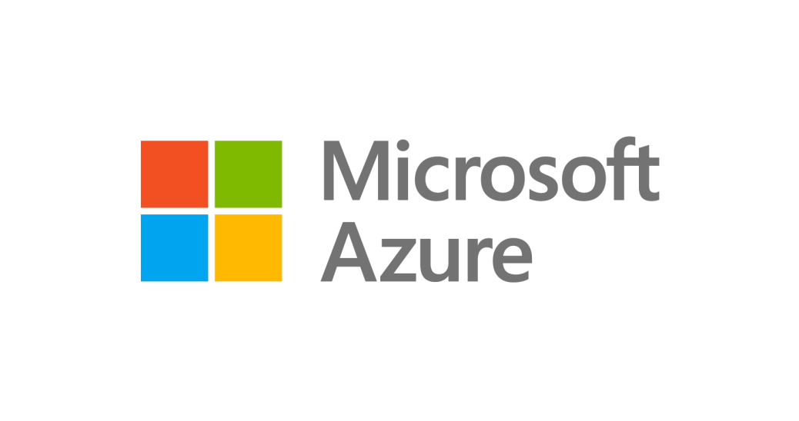

 

 

 

 

# Azure Python Labs at PyCon India

### :tada::snake: Welcome to out Python Virtual Labs for PyCon India Online 2020 :tada::snake:

A collection of labs demonstrating how to build Python applications with Azure and [Visual Studio Code](https://code.visualstudio.com/?WT.mc_id=pyconindia-github-cxa).

### :thinking: How to participate?

1. Join the Microsoft Python Discord (http://aka.ms/python-discord ) and the **#python-virtual-labs** channel to ask questions, get help with labs, and/or further instructions (also see: <https://aka.ms/python-virtual-labs> for our PyCon 2020 online experience).

2. Select and complete a Python Virtual Lab from this repository

3. Confirm lab completion and redeem your Azure Hero Badge and your virtual swag
   - You must complete at least one lab to qualify for the giveaway

---

## Virtual labs

### :heart::zap: Sentiment Analysis with Python Azure Functions

In this lab, you will build a serverless HTTP API with Azure Functions that takes a sentence as an input and returns the sentiment of the sentence.

- Build a serverless HTTP API with Azure Functions
- Run and debug the API locally on your machine
- Deploy the API to Azure Functions

[Go to lab](4-azure-functions-python-vscode/README.md) | Duration: 7 minutes

## :sunny: Hello World in Visual Studio Codespaces

Create and work with an environment in Visual Studio Codespaces, all on the browser.

- How to get started with a GitHub repo
- How to create and run a Hello World in Python
- How to run a Flask app

[Go to lab](9-vscodespaces/README.md)

## :page_facing_up: Document recognition with Python Azure Form Recognizer

In this lab, you will learn how to quickly store information you collect from your documents and receipts and prepare them for further analysis. You will learn to:

- Deploy new resources in Azure
- Write your own code using new Python packages for Azure
- Analyze the information returned from the service

[Go to lab](9-azure-cognitive-services/README.md)

## :mag: Explore Azure Database for PostgreSQL with Python

In this lab, you will learn how to import data into an Azure Database for PostgreSQL instance using a python script and the `psycopg2` module. You will learn to:

- Connect to an Azure Database for PostgreSQL
- Use the `psycopg2` to load and query data in the database.

[Go to lab](4-postgres/README.md)

## :100: Number Facts with Python Web Apps

In this lab, you will deploy a python app to App Service using the Azure CLI.

- Use `az webapp up` to quickly provision Azure resources and deploy your app to Azure App Service.
- Leverage the `local context` feature of Azure CLI to ease management operations.

[Go to lab](9-azure-web-apps/README.md)

## :whale: Developing a Django + PostgreSQL application in a Dev Container

Work in a dev container using Visual Studio Code

- Open existing dev container in VS Code with the Remote - Container extension
- Build a React front-end
- Initialize a PostgreSQL database
- Run a Django app

[Go to lab](9-vscode-django-postgres-dev-container/README.md)

## :bug: Debugging a Flask App with WSL in VS Code

Work with a Flask application using WSL in VS Code.

- Run/debug the Flask app
- Configure application tests
- Run application tests

[Go to lab](9-windows-subsystem-for-linux/README.md)

## :chart_with_upwards_trend: Real-Time Analytics on Azure Database for PostgreSQL - Hyperscale (Citus)

This workshop is meant to be an introduction to Azure Database for PostgreSQL Hyperscale (Citus). First, you will create a cluster to scale out PostgreSQL and turn it into a distributed database. Then, you will create a schema and tables, load test data, and create a rollup function to massively speed up your query workload.

[Go to lab](4-postgres-citus/README.md)
